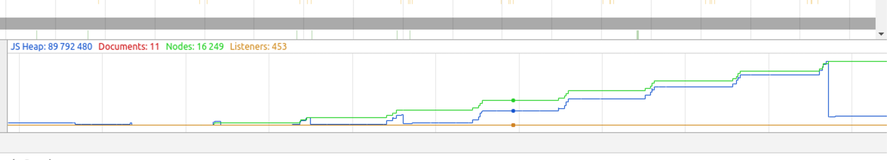

# What are we learning?
Making javascript code run fast, in several ways:

1. Plain execution speed
2. Consistent speed - no lag spikes (causing event loop block)
3. Longevity - no degradation over time

# Disclaimer: I may be wrong

# Why do it?

1. Lag-free interfaces - user satisfaction, quality feel
2. Turnaround time for computationally heavy server-side tasks
3. Save money, electricity, environment
4. Beauty, craftsmanship
5. Learning - exploring your code and your engine

# Pitfalls

1. Regression bugs - write tests before optimizing
2. Failure to find hotspots -> optimizations have negligible impact
3. Over-optimizing for certain engine or engine version
4. Modern JS engines are complex and advanced, have hidden optimization strategies
5. OS/hardware ghosts, for example OSX low battery/unplugged mode (actually happens)
6. Cold engine - first few runs through code may be slower than subsequent runs

# Where?

## Node.js
Consistent, known behavior, except for underlying system (operating system, virtualization, hardware)

Optimization can be engine specific, but think about the future - engine might change.

## Browsers
Semi-unknown behavior, or too many behaviors to optimize separately.

- Fuzzy problem - most performant approach not same in all browsers
- General, good-practice approaches needed
- Focus on optimizations that _probably_ make things easy for all/most engines
- Old school style is usually performant (lots of such code on the web)


# Measuring, or "profiling"

Many tools available, but:

## Chrome dev tools

- Timeline - mostly for interfaces and framerate/rendering profiling
- Profiles - for any code, good for finding hotspots

## In Node.js

1. Use built-in v8-profiler to generate dumps
2. Load dumps in Chrome dev tools, or other tools

(Disclaimer: Never did this)

## Magnitudes of speed

Just to give an idea - some time spent in typical events

1. Cache read 1-7 ns
2. Memory access 100 ns
3. Memory allocation 5000 ns? (0.005 ms)
4. Garbage collection 50 000 000 ns (50 ms)

-> If we avoid memory allocation and GC, we are winning



# Examples where I did optimization

[Elevator Saga](http://play.elevatorsaga.com/#devtest=true,challenge=18,timescale=300)

[fullofstars](http://magwo.github.io/fullofstars/)

[Unobservable](https://github.com/magwo/unobservable/blob/master/unobservable.js)


# Some optimization techniques

TL;DR: memory handling, in several ways:

1. Avoid allocation (it takes time)
2. Reduce churn - avoid prolonged and frequent garbage collection events
3. Don't leak memory.


## Avoiding memory allocations

### Use callstack variables
Engine may be smart about allocations, but...

By using stack variables, performance is guaranteed.

```javascript
function myFunction(anArray) {
  var a = 3; // a is on the callstack - no allocation
  var b = anArray; // b is on the callstack - no allocation
  var c = [anArray[0], anArray[1]]; // c on stack, but new allocated array :(
  var d = { foo: anArray[0] }; // d on stack but new allocated object
}
```

### Use object pools
Release objects of same type to an object pool so you can later reuse them. Several gains:

1. No churn, no GC
2. Low, predictable acquisition cost

### Pass in reused storage containers instead of returning new objects
Let's do it like it's 1969.

```javascript
  function computeSeveralThings(data, reusedResultStorage) {
    reusedResultStorage.specialSum = data[0] + data[1] * 2 + data[2];
    reusedResultStorage.sum = data[0] + data[1] + data[2];
    // No return, no object allocation - winning!
  }
```

### Avoid creating closures beyond startup phase
Closures binding local variables cause additional allocations. (there may be exceptions in various runtimes?)

```javascript
  // Don't do this repeatedly:
  return {
    respond: function(name) { return "Hey! " + name }
  }

  // Instead reuse functions:
  function respond(name) {
    return "Hey " + name;
  }
  // ...
  return {
    respond: respond
  }

```

### Use explicit copying instead of object iteration
```javascript
  // Don't
  for(var key in obj) {
    myOtherObj[key] = obj[key];
  }

  // Do
  myOtherObj.a = obj.a;
  myOtherObj.b = obj.b;
```

## Reduce memory churn

By for example using object pools (see above) or:

### By using smaller objects

1. By slimming down objects
2. By using prototypes to hold common properties and functions
3. By splitting objects and holding parts in separate arrays (exotic..)

This can also increase cpu cache hit rate. In general, small is fast, especially on iteration.

Also, engines might have specialized storage for objects small enough.

# Going deeper
Only do this when your memory handling is excellent, IMO.

Effect of these things is highly engine dependent.

### Reduce number of function calls
Inline code, cache computations, build LUTs, avoid recursion, avoid libraries.

### Avoid try/catch blocks
try/catch supposedly prevents some hidden optimizations.

-> Put the try/catch further out

### Use for loops, avoid .forEach
-> No function calls, usually faster.

### Avoid type-switching variables
For a function argument or variable, don't use different types.

Multi-type supposedly messes with hidden optimizations.
```javascript
function foo(a) {
  // ...
}
// Don't do this:
foo(3);
foo("3");
```

### Be careful with the `arguments` object
TL; DR: don't use

If you really need it, read up on performance characteristics.

`argument` usage was removed from the event system in Elevator - significant speedup

# YMMV `¯\_(ツ)_/¯`

It's a fuzzy problem.
